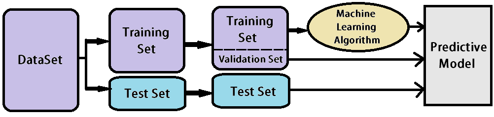

# Linear Regression Model for House Price Prediction


This project focuses on creating a linear regression model to predict house prices based on various features such as transaction date, house age, distance to the nearest MRT station, number of convenience stores, latitude, and longitude. Additionally, we analyze the performance of the model using metrics such as Mean Squared Error (MSE), Mean Absolute Error (MAE), and Root Mean Squared Error (RMSE). These metrics (MSE, NAE, RMSE) provide insights into how well the model is performing in terms of predicting house prices and helps to assess its accuracy and reliability. By evaluating these metrics, one can easily determine the effectiveness of this linear regression model for house price prediction and identify areas for potential improvement.

## Dataset


The dataset used for this project is stored in a CSV file named "Real estate.csv" available under the "Dataset" folder. It contains the following columns:

```json
Data types:
No                                          int64
X1 transaction date                       float64
X2 house age                              float64
X3 distance to the nearest MRT station    float64
X4 number of convenience stores             int64
X5 latitude                               float64
X6 longitude                              float64
Y house price of unit area                float64
dtype: object
```

1. No: Index of the data entry
2. X1 transaction date: Year and month of the transaction
3. X2 house age: Age of the house in years
4. X3 distance to the nearest MRT station: Distance to the nearest Mass Rapid Transit (MRT) station in meters
5. X4 number of convenience stores: Number of convenience stores nearby
6. X5 latitude: Latitude of the location
7. X6 longitude: Longitude of the location
8. Y house price of unit area: House price per unit area

## Usage

To replicate the project and analyze the performance of the linear regression model:

1. Clone this repository to your local machine:

```bash
git clone https://github.com/stevemats/HousePredAlgo.git
```

2. Navigate to the project directory and you'll find both a juypter notebook and a python script and run the chosen one:

```bash
cd HousePredAlgo
```

3. Ensure you have the required Python libraries installed. You can install them using pip:

```bash
pip install pandas scikit-learn numpy matplotlib seaborn
```

4. Run the Python script "linear_regression.py" to train the model and evaluate its performance:

```bash
python predalgo.py
```

This script will load the dataset, preprocess the data, split it into training and testing sets, train a linear regression model, evaluate its performance using MSE, MAE, and RMSE, and visualize the results.

## Results

After running the script, you'll see the following outputs:

- Mean Squared Error (MSE)
- Mean Absolute Error (MAE)
- Root Mean Squared Error (RMSE)
- Actual vs Predicted House Prices scatter plot
- Feature Importances bar plot

---

Project Source URL: https://github.com/stevemats/HousePredAlgo By: [Steve Matindi](https://github.com/stevemats)
